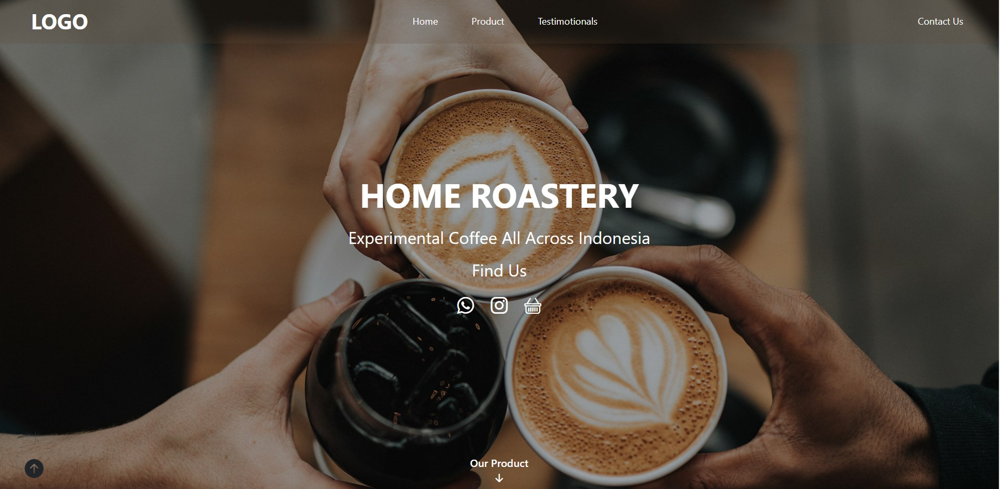
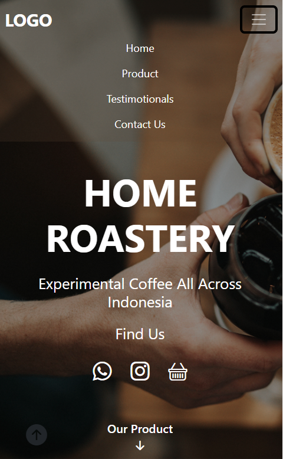

## Overview

Second personal project that i made is a landing page for my friends business. Its called home roastery and i made the design myself by doing figma

### Screenshot

### Links

- Live Site URL: not yet

## My process

### Built with

- Semantic HTML5 markup
- Bootstrap 5
- Bootstrap 5 icon
- Figma

### What I learned

I learned a lot as it was my first time designing with Figma and "slicing" the design into code

### Continued development

There's still a lot of improvement such as

- mobile background positioning
- logo change
- customizing review card
- and much minor details

at some point i think i will make this an e-commerence website with ReactJs and firebase/nodeJs as Backend

## Author

- Althafdaa
